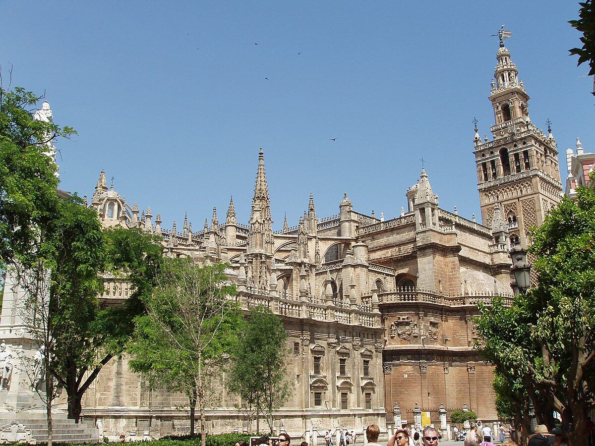
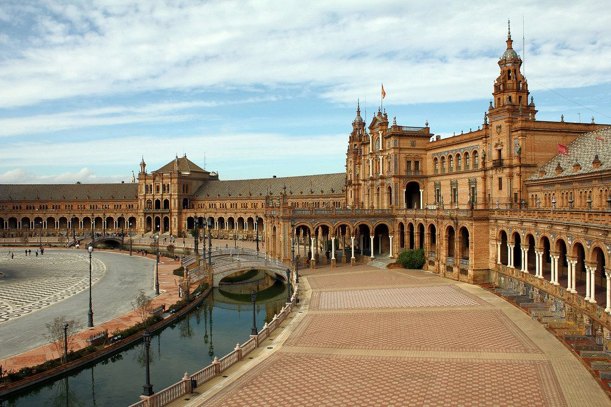
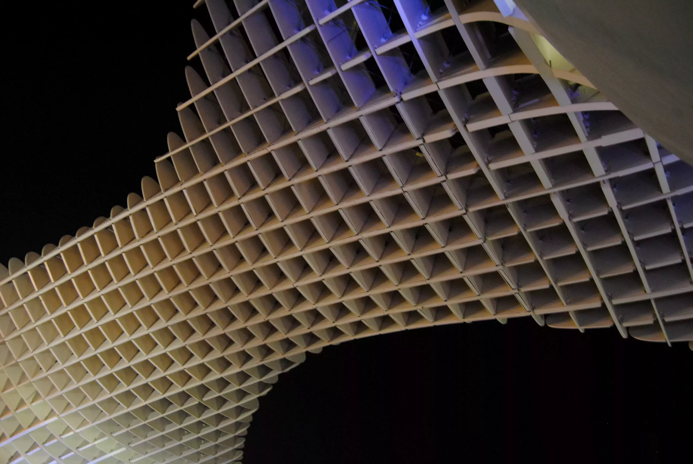
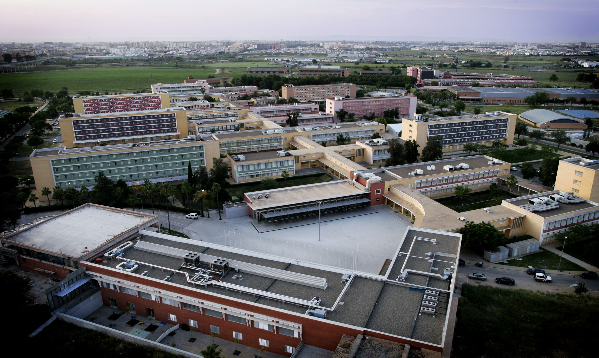

Title: Sevilla, el marco 🏢
Slug: sevilla
Date: 2022-01-13 18:20
Authors: Python España
Summary: Guía para disfrutar de Sevilla durante tu visita

# Bienvenidos a Sevilla

Sevilla no es solo una ciudad, es una experiencia. Pasear por sus calles es descubrir rincones llenos de historia, luz, alegría y vida. Aquí conviven lo clásico y lo moderno, lo monumental y lo cotidiano. Prepárate para disfrutar de su gente, su gastronomía, su cultura… y su magia.

---

## Qué hace especial a Sevilla

- ☀️ **Más de 3.000 horas de sol al año.** Luz garantizada y temperaturas agradables, especialmente en otoño y primavera.
- 🏛️ **Patrimonio impresionante.** La Giralda, la Catedral, el Real Alcázar, la Plaza de España… Cada esquina te dejará sin palabras.
- 🌆 **Ambiente vibrante.** Terrazas, bares, plazas llenas de vida y música en cada rincón.
- 🚲 **Ciudad muy caminable y con carril bici.** Moverte por Sevilla es fácil, cómodo y bonito.

---

## Cómo llegar y moverse

Llegar a Sevilla es muy sencillo:

- 🚄 **Tren AVE:** Desde Madrid (2h 30m), Barcelona, Málaga o Valencia.
- ✈️ **Aeropuerto internacional (San Pablo):** Conexiones directas con más de 50 ciudades europeas.
- 🚍 **Bus, tranvía y metro:** Cómodos y con buena cobertura dentro de la ciudad.
- 🚲 **Bicicleta:** Sevilla tiene una de las redes de carril bici más grandes de Europa. También puedes usar servicios de patinetes eléctricos o simplemente pasear, porque todo está cerca.

---

## Qué ver en Sevilla

No te puedes perder:

- 🏰 **Real Alcázar:** Un palacio de cuento. Patrimonio de la Humanidad y escenario de series como *Juego de Tronos*.
- 🏛️ **Catedral y La Giralda:** La catedral gótica más grande del mundo. Sube a la Giralda para disfrutar de las mejores vistas de la ciudad.
- 🏞️ **Plaza de España y Parque de María Luisa:** Un lugar espectacular para pasear, alquilar una barquita o hacer las mejores fotos de tu viaje.
- 🪵 **Las Setas (Metropol Parasol):** Una estructura de madera futurista en pleno centro. Sube al mirador para una panorámica de la ciudad.
- 🎭 **Barrio de Triana:** Cuna del flamenco, con calles llenas de encanto, cerámica y tapeo junto al río.

---

## Vivir Sevilla

La gastronomía sevillana es otro de sus grandes atractivos:

- 🍻 Tapeo sin fin: Salmorejo, espinacas con garbanzos, montaditos, pescaíto frito…
- 🥘 Terraza o taberna: Desde bares centenarios hasta gastrobares modernos.
- 🍷 Prueba un vino de Jerez, un vermut casero o una cerveza bien fría mientras ves la vida pasar desde cualquier terraza.

---

## Sevilla tech y joven

Sevilla no es solo tradición. Es una ciudad joven, dinámica y con un ecosistema tecnológico que la hace vibrante:

- 🚀 Comunidad de desarrolladores muy activa
- 🎓 Ciudad universitaria con ambiente joven, creativo y multicultural.

---

## Dónde será el evento

La **Universidad Pablo de Olavide**, sede del evento, está perfectamente conectada con el centro mediante tren de cercanías y metro (parada **Europa**). Además, el campus es amplio, verde y muy agradable para pasar unos días entre charlas, talleres... ¡y buen ambiente!

---

## Sevilla te espera

No hace falta que te convenzamos más. Vente con tiempo, piérdete por sus barrios, descubre sus rincones, prueba su comida y déjate llevar. **Sevilla es luz, alegría y vida.**

> **Nos vemos en Sevilla. 🌞**
